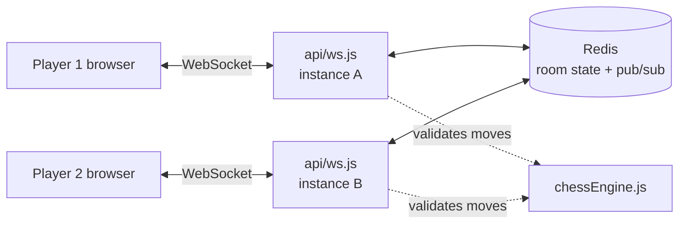

# OUTPOST-CHESS
<div align="center">


# Outpost Chess

### Chess, carved from wood &amp; light.

Pass the board to a friend beside you, or send a 5-character code to someone across the world.
Same rules. Same warm table. However far apart you are.

<br/>


<br/>

[](https://outpost-chess-iota.vercel.app)
[](https://outpost-chess-iota.vercel.app/mainpage)

[How it works](#-how-it-works) · [Run it locally](#-run-it-locally) · [Deploy your own](#-deploy-your-own)

</div>

---

## ♞ What is this?

Outpost Chess is a complete chess game built from scratch: **no chess library, no UI framework**.
The rules engine, the board, the hand-drawn piece set, and the real-time multiplayer layer are all written by hand.

It has two ways to play:

| Mode | What it does |
|---|---|
| **Pass &amp; Play** | One board, one device. Full rules enforced while you hand it back and forth. |
| **Play Online** | Create a room, share the code, and your opponent's moves appear live on your board. |

---

## ♟ Play with me

Want a game? It takes about 10 seconds:

1. Open **[outpost-chess-iota.vercel.app](https://outpost-chess-iota.vercel.app)** and tap **Play now**.
2. Choose **Play Online**, then **Create room**.
3. Send me the 5-character room code (or leave the room open in the lobby), and I'll join.

No account, no download. It works in any browser, on desktop or phone.

---

## ✦ Features

- **Complete rules engine:** legal-move generation, check, checkmate, stalemate, castling, en passant, and pawn promotion with a piece picker
- **Draw conditions:** stalemate, 50-move rule, and insufficient material
- **Server-side move validation:** in online games, every move is checked on the server with the same engine, so the board can't be cheated from the browser
- **Live multiplayer:** WebSocket rooms with 5-character codes (no confusing `0/O` or `1/I`)
- **Open-room lobby:** browse and join games that are waiting for an opponent
- **Auto-reconnect:** drop your connection mid-game and the client resumes with a saved room token
- **Recent games:** a history of completed matches
- **Quality-of-life:** move list, captured pieces, undo (pass &amp; play), resign
- **Hand-drawn pieces:** an ivory-and-walnut set drawn as vector art, not photographed
- **Animated landing page:** a Three.js hero scene over a warm walnut-and-gold theme

---

## ⚙ How it works



Serverless function instances don't share memory, so two players in the same room can land on different instances.
To handle that, **all room state lives in Redis**, and **Redis Pub/Sub** relays each move between instances.
Whichever instance receives a move validates it with the shared engine, saves it, and publishes it to the room's channel.

**Message types over the socket:** `create` · `join` · `reconnect` · `move` · `resign`

---

## 🗂 Project structure

```
outpost-chess/
├── index.html          # Landing page (Three.js hero)
├── mainpage.html       # The game: board, lobby, move list
├── chessEngine.js      # Rules engine, shared by client and server
├── favicon.svg
├── api/
│   ├── ws.js           # WebSocket endpoint (Vercel Function)
│   ├── rooms.js        # GET /api/rooms    : open rooms for the lobby
│   └── history.js      # GET /api/history  : recent completed matches
├── lib/
│   ├── chessEngine.js  # Engine copy used by the API functions
│   ├── redis.js        # Redis command + subscriber connections
│   └── roomStore.js    # Room create/join/save + match history
├── server/             # Older standalone Express server (in-memory rooms)
└── vercel.json
```

---

## 🚀 Run it locally

You'll need [Node.js](https://nodejs.org) 18+, the [Vercel CLI](https://vercel.com/docs/cli), and a free Redis database from [Upstash](https://upstash.com).

```bash
# 1. Install dependencies
npm install
npm install -g vercel

# 2. Link the folder to a Vercel project
vercel link

# 3. Pull your REDIS_URL down locally
vercel env pull .env.local

# 4. Start everything (static pages + API) on http://localhost:3000
vercel dev
```

Open `http://localhost:3000`, pick **Play Online**, create a room, then join it from a second browser tab to test multiplayer.

---

## ☁ Deploy your own

1. **Create a Redis database** on [Upstash](https://upstash.com) and copy the `rediss://...` connection string.
2. **Push this repo to GitHub.**
3. **Import it in Vercel** (*New Project → Import*). No build command or output directory needed.
4. **Add an environment variable:** `REDIS_URL` = your connection string (*Settings → Environment Variables*).
5. **Deploy.** You'll get a free `*.vercel.app` domain, and you can add a custom one under *Settings → Domains*.

---

## ⚠ Known trade-offs

These are design choices worth knowing about, not hidden bugs.

- **5-minute WebSocket cap:** Vercel closes every WebSocket after 300 seconds. The client reconnects automatically with the saved room token, so you'll briefly see "Reconnecting…" in long games.
- **Rooms expire after 2 hours** of inactivity.
- **No move locking:** two near-simultaneous writes to one room are theoretically possible, but unlikely in a turn-based game. A production app would add optimistic locking with a version number.
- **Threefold repetition** is not yet a draw condition.


---

## 🤝 Contributing

Ideas and pull requests are welcome. Open an issue first for anything big so we can talk it through.

---

<div align="center">

Built by **[Aniket](https://github.com/Btwitsikaris)** · *Building from pixels to intelligence.* 🌿

</div>
